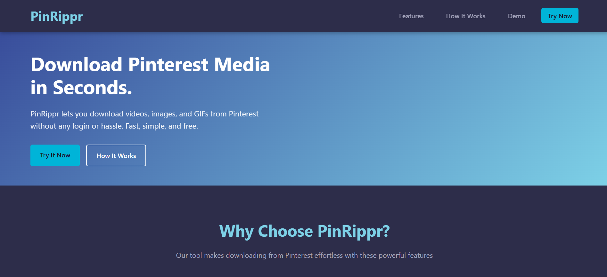
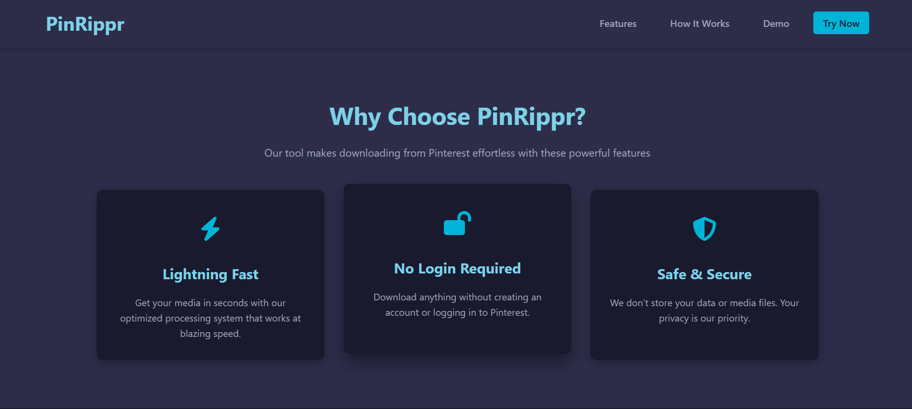

# 📌 PinRippr

**PinRippr** is a free and open-source Pinterest media downloader built using **Flask**, **BeautifulSoup**, and **requests**.

This tool allows users to preview and download images and videos from any valid Pinterest link — just paste the URL and go!

---

## 🔍 Features

- 📷 Preview Pinterest images & videos
- 📥 Download in one click
- 🌐 User-friendly UI
- ⚡ Lightweight & fast
- 🔐 No login required

---

## 🚀 Live Demo

👉 [Click here to use PinRippr](https://pinrippr.onrender.com/)

---

## 🖼️ Screenshot




---

## 🛠️ Technologies Used

- Python
- Flask
- HTML, CSS
- JavaScript
- BeautifulSoup
- Requests

---

## 📦 Installation (For Local Testing)

```bash
git clone https://github.com/RishiRana27/PinRippr.git
cd PinRippr
pip install -r requirements.txt
python app.py
